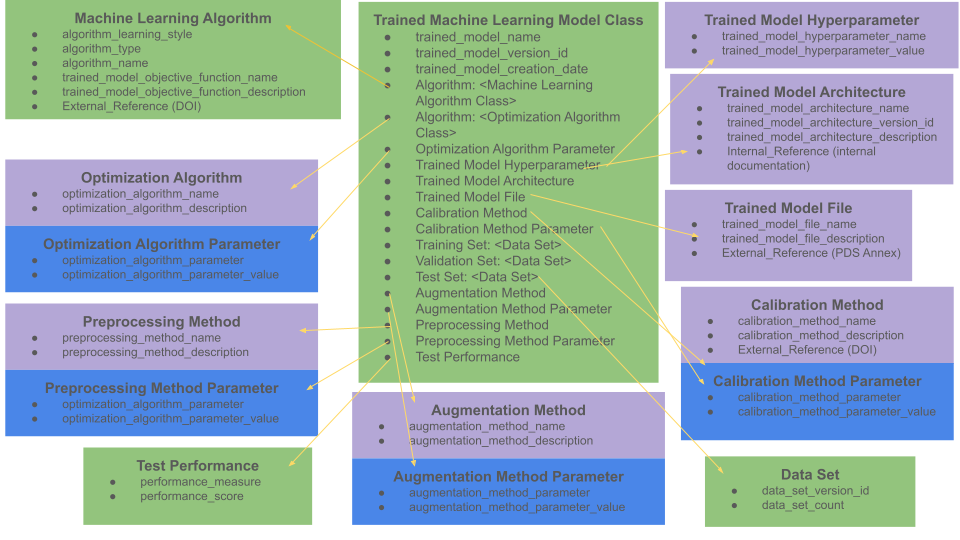

PDS4 Machine Learning Analysis Local Data Dictionary User's Guide
=================================================================

Date: November 2, 2023

Authors: Kiri Wagstaff and Sara Bond

Overview of the Machine Learning Analysis Local Data Dictionary
---------------------------------------------------------------

This dictionary is designed to provide relevant keywords to describe
products that are the output of a machine learning model.  The machine
learning model may have been used to analyze images, sensor data, time
series, or other products in the PDS.  Examples of ML products include
a collection of per-image classification predictions, thermal
anomalies detected in infrared observations, unusual events in time
series data, etc.

This dictionary enables the specification of key descriptors about the
machine learning model that generated the product.  They include the
machine learning algorithm that was used, what data was used to train
and evaluate the model, and what performance was obtained.

Questions about this dictionary can be directed to the steward, Sara Bond
(sara.a.bond@jpl.nasa.gov)

Suggestions for improvements or new capabilities are welcomed!  Please
create an issue here:

https://github.com/pds-data-dictionaries/PDS4-LDD-Issue-Repo

How to Include the Machine Learning Analysis Local Data Dictionary in a PDS4 Label
----------------------------------------------------------------------------------

A data dictionary consists of a ``.xsd`` schema file and a ``.sch``
Schematron file.  You can obtain the latest dictionary files here:

https://pds.nasa.gov/datastandards/dictionaries

New releases of the Machine Learning Analysis dictionary are also
available here:

https://github.com/pds-data-dictionaries/ldd-ml

To use the Machine Learning Analysis dictionary with your product,
include this attribute inside the ``<Product_Observational>`` tag in your
PDS4 ``.xml`` file to access the "ml" dictionary:

.. code-block:: xml

	xmlns:ml="http://pds.nasa.gov/pds4/ml/v1"

These keywords are employed within the ``<Discipline_Area>`` tag, inside
the ``<Observation_Area>`` tag.  All ML-related content should be
enclosed within a ``<ml:Machine_Learning>`` tag.  Here is a high-level
example:

.. code-block:: xml

	<Discipline_Area>
	  <ml:Machine_Learning>
	    <ml:Trained_Machine_Learning_Model>
	      <ml:trained_model_version_id>2.0</ml:trained_model_version_id>
	      <ml:trained_model_name>TestNet</ml:trained_model_name>
	      <ml:Machine_Learning_Algorithm>
	      ...
	      </ml:Machine_Learning_Algorithm>
	      <ml:Training_Set>
	      ...
	      </ml:Training_Set>
	      <ml:Test_Set>
	      ...
	      </ml:Test_Set>
	      <ml:Test_Performance>
	      ...
	      </ml:Test_Performance>
	    </ml:Trained_Machine_Learning_Model>
	  </ml:Machine_Learning>
	</Discipline_Area>

Please see the ``test/`` directory for additional examples.  Those with
VALID in their filenames are valid PDS4 labels.

Organization of Classes and Attributes
--------------------------------------

The Machine Learning Analysis Local Data Dictionary (henceforth the ML
LDD) consists of fifteen classes.

Trained_Machine_Learning_Model
------------------------------

This is the master class, which includes the name and version of the
model as well as a connection to the ``Machine_Learning_Algorithm`` that
was used to train it and the ``Data_Set``(s) and ``Performance`` obtained.

.. code-block:: xml

	<ml:Trained_Machine_Learning_Model>
	   <ml:trained_model_version_id>2.0</ml:trained_model_version_id>
	   <ml:trained_model_name>TestNet</ml:trained_model_name>
	   <ml:Machine_Learning_Algorithm>
	   ...
	</ml:Trained_Machine_Learning_Model>

Machine_Learning_Algorithm
--------------------------

This class encapsulates the name and type of learning algorithm, its
learning style, the name and description of the trained model objective
function, and an external reference (a citation, such as a DOI) for the
algorithm.  For example:

.. code-block:: xml

	<ml:Machine_Learning_Algorithm>
	   <ml:algorithm_learning_style>Supervised_Learning</ml:algorithm_learning_style>
	   <ml:algorithm_type>Convolutional_Neural_Network_Classifier</ml:algorithm_type>
	   <ml:algorithm_name>Fine-tuned AlexNet (ImageNet)</ml:algorithm_name>
	   <ml:trained_model_objective_function_name>Negative Log Likelihood</ml:trained_model_objective_function_name>
	   <:ml:trained_model_objective_function_description>
	                Negative log-likelihood is a loss function used in multi-class classification. Calculated as −log(y),
	                where y is a prediction corresponding to the true label, after the Softmax Activation Function was applied.
	              </:ml:trained_model_objective_function_description>
	   <pds:External_Reference>
	      <pds:doi>10.5555/2999134</pds:doi>
	      <pds:reference_text>Krizhevsky, A., Sutsekver, I., and
	         Hinton, G.E., "Imagenet classification with deep
	         convolutional neural networks," Advances in Neural
	         Information Processing Systems 25, p., 1097-1105, 2012.
	      </pds:reference_text>
	      <pds:description>AlexNet citation</pds:description>
	   </pds:External_Reference>
	   ...
	<ml:Machine_Learning_Algorithm>

Data_Set
--------

This class contains information about a collection of data used train,
validate, or test the model.  Only the training set is required.

.. code-block:: xml

	<ml:Training_Set>
	   <ml:data_set_version_id>1.0</ml:data_set_version_id>
	   <ml:data_set_size>5000</ml:data_set_size>
	</ml:Training_Set>

Performance
-----------

This class captures the performance obtained by the model, usually on
a test set.  Performance specification is optional.  Multiple
instances of this class can be provided to accommodate more than one
measure.

.. code-block:: xml

	<ml:Test_Performance>
	   <ml:performance_measure>Test accuracy</ml:performance_measure>
	   <ml:performance_score>0.93</ml:performance_score>
	</ml:Test_Performance>

Augmentation_Method
-------------------

This class contains information about a data set's augmentation method, 
including name and description.

.. code-block:: xml

	<ml:Augmentation_Method>
	    <ml:augmentation_method_name>horizontal flipping</ml:augmentation_method_name>
	    <ml:augmentation_method_description>Flip a given image horizontally</ml:augmentation_method_description>
	</ml:Augmentation_Method>

Augmentation_Method_Parameter
-----------------------------

This class contains information about a data set's augmentation method parameters,
including their names and associated values.

.. code-block:: xml

	<ml:Augmentation_Method_Parameter>
	    <ml:augmentation_method_parameter_name>gamma</ml:augmentation_method_parameter_name>
	    <ml:augmentation_method_parameter_value>[0.5, 1.5]</ml:augmentation_method_parameter_value>
	</ml:Augmentation_Method_Parameter>

Optimization_Algorithm
----------------------

The Optimization_Algorithm class describes the optimization algorithm used, including name and description.

.. code-block:: xml

	<ml:Optimization_algorithm>
	    <ml:optimization_algorithm_name>Stochastic gradient descent</:ml:optimization_algorithm_name>
	    <ml:optimization_algorithm_description>
            Stochastic gradient descent (often abbreviated SGD) is an iterative method for optimizing
            an objective function with suitable smoothness properties. It can be regarded as a stochastic
            approximation of gradient descent optimization, since it replaces the actual gradient by an estimate thereof.
        </ml:optimization_algorithm_description>
	 </ml:Optimization_algorithm>

Optimization_Algorithm_Parameter
--------------------------------

The Optimization_Algorithm_Parameter class describes the optimization 
algorithm parameters used, including their names and associated values.

.. code-block:: xml

	<ml:optimization_algorithm_parameter>
	     <ml:parameter_name>conv1 learning rate</ml:parameter_name>
	     <ml:parameter_value>0.001</ml:parameter_value>
	</ml:optimization_algorithm_parameter>

Preprocessing_Method
--------------------

The Preprocessing_Method class contains information about a data set's preprocessing method.

.. code-block:: xml

	<ml:preprocessing_method>
		<ml:preprocessing_method_name>Center Cropping</ml:preprocessing_method_name>
		<ml:preprocessing_method_description>Center cropping a given image</ml:preprocessing_method_description>
	</ml:preprocessing_method>

Preprocessing_Method_Parameter
------------------------------

The Preprocessing_Method_Parameter class contains information about a 
data set's preprocessing method parameters, including their names and 
associated values.

.. code-block:: xml

	<ml:preprocessing_method_parameter>
		<ml:preprocessing_method_name>Resizing</ml:preprocessing_method_name>
		<ml:preprocessing_method_description>Resize a given image to 227x227 pixels</ml:preprocessing_method_description>
	</ml:preprocessing_method>

Trained_Model_Hyperparameter
----------------------------

The Trained_Model_Hyperparameter class describes the trained model hyperparameters, including their names and associated values.

.. code-block:: xml

	<ml:trained_model_hyperparameter>
	    <ml:hyperparameter_name>batch size</ml:hyperparameter_name>
	    <ml:hyperparameter_value>256</ml:hyperparameter_value>
	</ml:trained_model_hyperparameter>

Trained_Model_Architecture
--------------------------

The Trained_Model_Architecture class describes the trained model 
architecture. An internal reference to the architecture is optional.

.. code-block:: xml

	<ml:trained_model_architecture>
	        <ml:trained_model_architecture_name>MSLNet v3</ml:trained_model_architecture_name>
	        <ml:trained_model_architecture_version>3.0</ml:trained_model_architecture_version>
	        <ml:trained_model_architecture_description>
	          MSLNet version 3 architecture description
	        </ml:trained_model_architecture_description>
			...
	</ml:trained_model_architecture>

Trained_Model_File
------------------

The Trained_Model_File class describes the trained model file. An 
external reference for the trained model file is required.

.. code-block:: xml

	<ml:trained_model_file>
		<ml:trained_model_file_name>MSLNet v3 model file</ml:trained_model_file_name>
		<ml:trained_model_file_description>MSLNet v3 model file in Caffe format</ml:trained_model_file_description>
		<pds:External_Reference>
			<pds:doi>XX.XXXX/XXXX.XXXX.XXXX</pds:doi>
	 		<pds:reference_text>
				MSLNet v3 model file in PDS Annex
			</pds:reference_text>
			<pds:description>MSLNet v3 model file in PDS Annex</pds:description>
		</pds:External_Reference>
	</ml:trained_model_file>

Calibration_Method
------------------

The Calibration_Method class describes the Calibration Method. An 
external reference to a citation, such as a DOI, is optional.

.. code-block:: xml

	<ml:calibration_method>
		<ml:calbration_method_name>Temperature Scaling</ml:calbration_method_name>
		<ml:calibration_method_description>
		Calibrated the trained model's posterior proabbilities using temperature scaling method
		</ml:calibration_method_description>
	    <pds:External_Reference>
			<pds:doi>10.48550/arXiv.1706.04599</pds:doi>
			<pds:reference_text>
				Chuan Guo, Geoff Pleiss, Yu Sun, Kilian Weinberger, "On Calibration of Modern Neural Networks", ICML, 2017.
			</pds:reference_text>
			<pds:description>Classifier calibration paper</pds:description>
		</pds:External_Reference>
	</ml:calibration_method>

Calibration_Method_Parameter
----------------------------

The Calibration_Method_Parameter class describes the Calibration 
Method parameters, including their names and associated values.

.. code-block:: xml

	<ml:calibration_method_parameter>
		<ml:calibration_method_parameter_name>temperature</ml:calibration_method_parameter_name>
		<ml:calibration_method_parameter_value>1.31</ml:calibration_method_parameter_value>
	</ml:calibration_method_parameter>

Definitions
-----------

Alphabetical list of attributes:

- ``algorithm_learning_style``: choose ``Supervised_Learning``,
  ``Semisupervised_Learning``, or ``Unsupervised_Learning``
  (ASCII_Short_String_Collapsed)
- ``algorithm_name``: free text name for the algorithm (ASCII_String)
- ``algorithm_type``: currently onlygi
  ``Convolutional_Neural_Network_Classifier`` is available, but we plan
  to expand the list as needed (ASCII_Short_String_Collapsed)
- ``augmentation_method_description``: free text description to provide further detail on the augmentation method
- ``augmentation_method_name``: free text name for the augmentation method
- ``augmentation_method_parameter``: free text field to name the parameter of the augmentation method
- ``augmentation_method_parameter_value``: free text field to assign value to named parameter
- ``calibration_method_description``: free text description to provide further detail on the calibration method
- ``calibration_method_name``: free text name for the calibration method
- ``calibration_method_parameter``: free text field to name the parameter of the calibration method
- ``calibration_method_parameter_value``: free text field to assign value to the named parameter
- ``data_set_count``: number of items in a data set (ASCII_Integer)
- ``data_set_version_id``: version of the data set (ASCII_VID)
- ``optimization_algorithm_description``: free text description to provide further detail on the optimization algorithm
- ``optimization_algorithm_name``: free text name for the optimization algorithm
- ``optimization_algorithm_parameter``: free text field to name the parameter of the optimization algorithm
- ``optimization_algorithm_parameter_value``: free text field to assign value to the named parameter
- ``performance_measure``: free text name of the measure/metric used to
  report performance (ASCII_Short_String_Collapsed)
- ``performance_score``: real-valued score associated with a performance
  measure (ASCII_Real)
- ``preprocessing_method_description``: free text description to provide further detail on the preprocessing method
- ``preprocessing_method_name``: free text name for the preprocessing method
- ``preprocessing_method_parameter``: free text field to name the parameter of the preprocessing method
- ``preprocessing_method_parameter_value``: free text field to assign value to the named parameter
- ``trained_model_name``: name given to the trained model
  (ASCII_Short_String_Collapsed)
- ``trained_model_architecture_description``: free text description to provide further detail on the trained model architecture
- ``trained_model_architecture_name``: free text name for the trained model architecture
- ``trained_model_architecture_version_id``: version of the trained model architecture
- ``trained_model_creation_date``: Specifies date model was created, in Year/Month/Day format. (ASCII_Date_YMD)
- ``trained_model_file_description``: free text to provide description of the trained model file
- ``trained_model_file_name``: free text name of the trained model file
- ``trained_model_hyperparameter_name``: free text name of the trained model hyperparameter
- ``trained_model_hyperparameter_value``: free text field to assign value to the named hyperparameter
- ``trained_model_objective_function_name``: name given to objective function (ASCII_Short_String_Collapsed)
- ``trained_model_objective_function_description``: description of named objective function (ASCII_Short_String_Collapsed)
- ``trained_model_version_id``: version of the model (ASCII_VID)